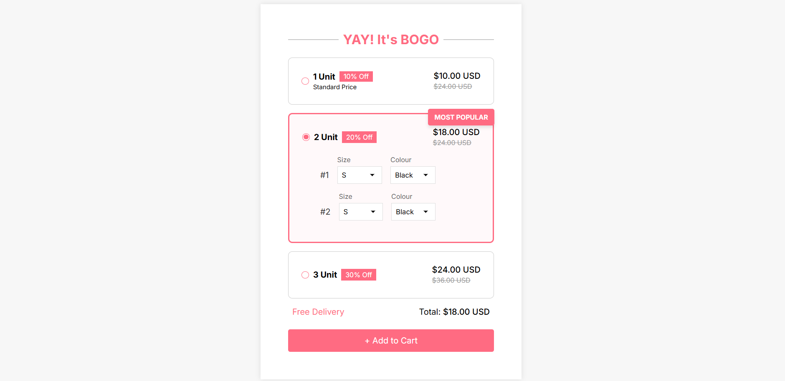

# 🎁 Bundle Selector

A clean, responsive, and user-friendly bundle selection UI that allows users to choose between multiple product bundles with customizable options for size and color. Built with **HTML**, **CSS**, and **JavaScript**, this interface is ideal for e-commerce platforms offering BOGO or multi-unit discount offers.

## 📸 Preview

 <!-- Optional: add a screenshot of the UI -->

## 🚀 Features

- Select from multiple bundle offers (1, 2, or 3 units)
- Customize each item with size and color
- Auto-update total price based on selection
- Highlight most popular option
- Responsive and modern design
- Vanilla JavaScript (no frameworks)

## 🛠 Tech Stack

- **HTML5** – Semantic structure
- **CSS3** – Custom styling with flexbox and transitions
- **JavaScript (ES6)** – Dynamic selection logic
- **Google Fonts** – Inter font family

## 📂 Project Structure

